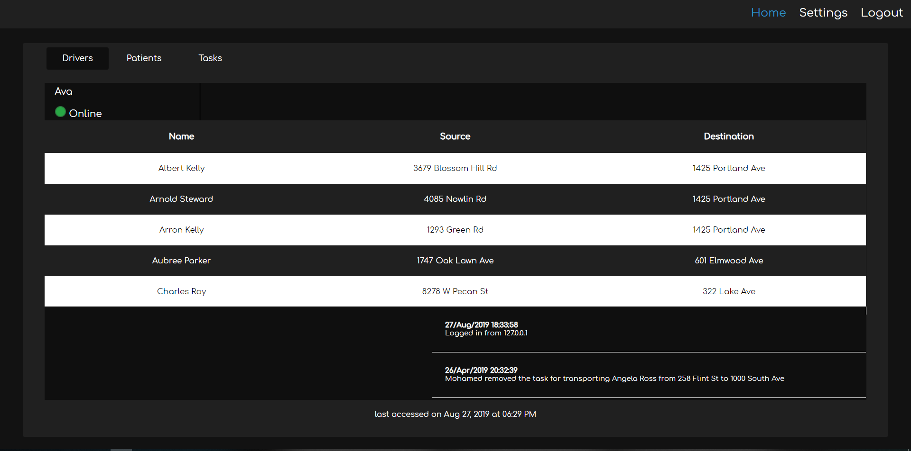

# MedLyft

An Uber like system for delivering people to and from their appointments.
The program is not fully done(Only dispatcher side is done), but what is done works.



### How does it work?

[The system can be configured to only accept web-logins from a dispatcher.]
The system can be divided into two groups, dispatchers, and drivers.

#### Dispatcher

-   Can assign tasks to drivers
-   Can unassign tasks from a driver
-   Can see the log of a driver
-   Can see the information of the patient (Patient info is suppose to be coming from a government database)

#### Driver

-   Can accept or deny any task that is assigned to him or her
-   Can only see a starting point and an ending point for a given task, can not see patient information

### Requirements

-   Python3.7
-   mysql

### Mysql info

-   port: 3306
-   X-protocol port: 33060
-   Username: root
-   Password: TumblrFuckingSucks123!@#

### Root

-   Username: Mohamed01
-   Password: TumblrFuckingSucks123!@#

### Other accounts

-   Username: [name]01
-   Password: TumblrFuckingSucks123!@#

## Installation

```sh
python3
```

### Create a virtual environment

```sh
python -m venv env_medlyft
```

### Activate the virtual enviroment

```sh
source env_medlyft/Scripts/activate
```

### Install Python packages

```sh
pip install -r requirements.txt
```

### Mysql

-   import the database.sql file

## Usage

### Start the server

```sh
python medlyft.py
```

The site will be hosted on the following link: localhost:5000
